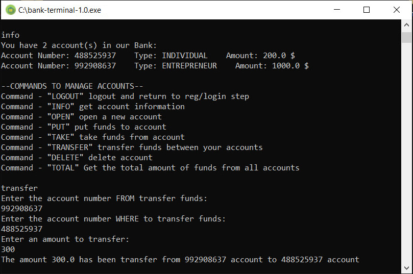

## bank-terminal

### This program simulates a bank using the terminal of the operating system

***Description:***

This JAVA code example demonstrates how to work with strings and regular expressions 
and track down ways to incorrectly enter data to avoid errors and bugs in the program.

***How to use:***

Create the "Main" class run configuration in your IDE and start the program.
The program is designed for intuitive data entry. Follow the commands provided by the application 
for a particular operation. The user can register as a bank client and then open various accounts
such as Entrepreneur, Individual, or Legal Entity. Each type of account charges transaction fees differently. 
In addition, you can log in as a bank manager and take advantage of unique operations 
available only to a bank manager. 
Manager login: Robert  
Manager password: rob123  

***Tools used:***

Java  
Maven  

